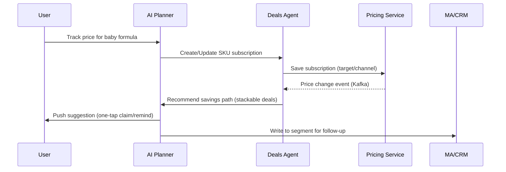

# Supermom: Agentic, AI‑First, Community‑Driven Platform

## Executive Summary
Supermom will evolve from a B2B2C marketing platform into an agentic, AI‑first, community‑driven ecosystem that serves moms (B2C) and brands (B2B). The core interface is an AI assistant embedded across Mobile App, Web, and light‑touch channels (e.g., WhatsApp). Existing assets (LeadGen/Campaigns, MA/CRM, Survey/UTM, UGC/KOM, Affiliate, Data Warehouse) will be unified behind a programmable orchestration layer, enabling autonomous campaign recommendations, community challenges, and measurable ROI. Phase rollout over 12–15 months ensures regulatory compliance (PDPA/GDPR), scalability, and market fit.

---

## 1) AI‑Driven B2C Consumer App/Web (AI chatbot as the core)
### Target Users and Channels
- Moms in pre‑pregnancy, pregnancy, newborn, infant stages; multi‑language across EN/ID/TH/VI/MY/PH.
- Channels: Mobile App (React Native), Web (Next.js), WhatsApp Business; optional LINE for certain markets.

### Core Experiences
- Trusted Search & RAG: Prioritize hospital/government/associations as sources; show citations and medical disclaimers.
- Price Watch & Savings Paths: Subscribe to SKUs, track price history, compute stackable deals, notify when target price is met.
- Benefits/Events: Localized benefits, programs, expos; “expo assistant” for route planning and on‑site checklists.
- Timeline & Reminders: Vaccines, checkups, subsidies, replenishment; integrate calendar and MA/CRM triggers.
- MomGenie 2.0 (AI chat): Conversation‑to‑action (set reminders, register for events, subscribe to price alerts, submit UGC).

### Integrations with Hospitals/Clinics/Merchants/Brands
- Trusted directory with verifiable labels (TrustLabel) and profile pages.
- Non‑diagnostic medical guidance and triage prompts with clear disclaimers.
- One‑tap redemption/join for brand activities, samples, rebates; persistent receipts.

### UX Principles
- Multilingual, low‑bandwidth optimization; single‑hand interactions; four UI states (default/loading/empty/error).
- Safety: Sensitive medical prompts, source disclosure, ability to report content.

---

## 2) High‑Level Architecture and Tech Stack
Architecture style: Event‑driven layered design. First 6 months adopt a “modular monolith + independently deployable components,” gradually factoring into services as traffic and team scale.

```mermaid
flowchart TB
  subgraph Clients[Experience Layer]
    A[Mobile App (RN)]
    B[Web (Next.js)]
    C[WhatsApp/LINE]
  end
  A & B & C --> G[API Gateway/BFF]

  subgraph Services[Business Services]
    S1[Auth & Consent]
    S2[Profile & Stage]
    S3[Content & RAG]
    S4[Pricing & Deals]
    S5[Benefits & Events]
    S6[UGC & KOM]
    S7[Token & Rewards]
    S8[MA & CRM]
    S9[Brand Console]
    S10[Agent Orchestrator]
  end

  G --> S1 & S2 & S3 & S4 & S5 & S6 & S7 & S8 & S9 & S10

  subgraph Data[Data & Intelligence]
    D1[(Postgres/Redis)]
    D2[(Warehouse: BQ/Snowflake)]
    D3[(Vector DB: pgvector/Weaviate)]
    D4[(Feature Store)]
    D5[LLM Gateway]
    D6[Message Bus: Kafka/PubSub]
  end

  S3 --> D3
  S4 --> D1
  S5 --> D1
  S6 --> D1
  S7 --> D1
  S8 --> D2
  S9 --> D2
  S10 --> D3 & D4 & D5 & D6

  G <-.-> O[Observability & SecOps]
```

### Components and Responsibilities
- Experience: RN/Expo mobile, Next.js App Router web, WhatsApp Business webhook integration.
- Edge: API Gateway (Kong/NGINX), BFF (GraphQL/REST; Next.js Route Handlers) for aggregation and auth.
- Business Services:
  - Auth & Consent: OIDC (Auth0/Cognito/Keycloak); consent service with purpose‑based flags, audit log.
  - Profile & Stage: Stage (pre‑pregnancy/pregnancy/month‑age), preferences, device binding.
  - Content & RAG: ETL ingestion, curation, vector indexing (pgvector/Weaviate/Pinecone), reranking.
  - Pricing & Deals: SKU catalog, channel prices, history, stackable savings calculator, subscriptions, notifications.
  - Benefits & Events: Localized lists, enrollment, ticketing, expo routing.
  - UGC & KOM: Submission workflow, QA/review, task tickets, KOM roster and assignment.
  - Token & Rewards: Off‑chain ledger (points), rules engine, redemption store, fraud controls.
  - MA & CRM: Email/WhatsApp orchestration, segmentation, Meta Lead sync.
  - Brand Console: Activity setup, budget/KPI, A/B testing, attribution/reporting, optional Clean Room.
- Data & Intelligence:
  - Warehouse (BQ/Snowflake) as source of truth; dbt for ELT; event bus (Kafka/PubSub) for decoupling.
  - Vector DB for RAG; Feature Store (Feast/Tecton) for personalization features.
  - LLM Gateway to abstract providers (OpenAI/Anthropic; fallback to on‑prem Llama).
- Observability & SecOps: OpenTelemetry traces/metrics/logs; Grafana/Prometheus/Tempo/Loki dashboards; SIEM.

### Suggested Tech Stack
- Frontend: React Native (Expo EAS), Next.js (App Router), TypeScript, Tailwind/NativeWind, i18next.
- Backend: TypeScript (NestJS) primary; Python (FastAPI) for data/ML services; Redis; Postgres.
- LLM & Retrieval: LangChain/LangGraph; rerank with Cohere/E5; prompt guardrails; function/tool calling first.
- Data: Postgres (OLTP + pgvector), Redis cache, BigQuery/Snowflake, Kafka/PubSub, dbt, Airbyte/Batch ETL.
- Ops: K8s (EKS/GKE), ArgoCD, Argo Workflows, Terraform, Vault/KMS.

---

## 3) Agentic AI Design (Autonomy and Feedback Loops)
### Roles and Goals
- Moms: trusted answers, reminders, benefits, price savings, personalized recommendations.
- KOM: task creation and execution, content QA, rewards for quality.
- Ops/Brands: automated recommendations, campaign optimization, transparent ROI.

### Multi‑Agent Collaboration
- Planner Agent: parse intent and context; break down tasks; call sub‑agents/tools.
- Knowledge Agent (RAG): retrieve from whitelisted sources; rerank; structure answers; add medical prompt.
- Deals Agent: track SKUs; compute stackable savings; estimate “price‑to‑buy”; manage subscriptions.
- Quests Agent: create/recommend community challenges; generate task lists and reward rules.
- KOM Ops Agent: match KOMs, assign tasks, monitor completion and quality metrics.
- MA Agent: trigger segments, messaging, and reactivation (Email/WhatsApp/Push) based on events.

### Tools (non‑exhaustive)
- profile_get/update, consent_check, vector_search, rerank, calendar_write, push_notify,
  whatsapp_send, lead_submit, deal_subscribe, event_register, ugc_submit,
  token_mint/burn/transfer, kom_assign, ab_test_start, meta_lead_sync.

### Feedback and Learning
- Explicit: helpful/not helpful, report, quality score; Implicit: clicks, dwell, conversion, redemption.
- Online: contextual bandits for strategy/ranking.
- Offline: automatic regression suite for safety, factuality, task completion, and business KPIs.

### Example Interaction (Price Alert → Suggestion → One‑Tap Redemption)


---

## 4) Community & Token Economy (Incentives, Quality, Anti‑Fraud)
### Token Shape and Path
- Year 1: Off‑chain “points” ledger for compliance, low cost, reversibility.
- Keep a bridge interface for future on‑chain integration where compliant.

### Participation and Rewards
- Moms: surveys, UGC creation, campaign promotion, lead conversions, KOM referrals → earn points.
- KOM: high‑quality content, on‑time delivery, conversion impact → earn points + cash/gifts.
- Quality: approvals, quality scores, low dispute rate → multipliers.
- Penalties: fake/plagiarized/volume gaming → deductions, freeze, blacklist.

### Economics & Quality Controls
- Issuance rules: inflation cap, budget pools, task difficulty multiplier, quality multiplier.
- Quality scoring: hybrid model + human (duplicate detection, image/text forgery checks, semantic similarity, credit history).
- Anti‑fraud: device fingerprinting, behavioral anomaly detection, linked‑account detection, geo/time checks.

### Redemption & Entitlements
- Redemption store: brand vouchers, samples, memberships, cash vouchers.
- Tiered unlocks: KOM candidacy, early registrations, beta access.

---

## 5) B2B Integration (Transparency and ROI)
### Brand Console
- Campaign setup: audience targets, budget/limits, incentives, geos/languages, compliance approvals.
- Leads & Attribution: UTM/deeplink/fingerprint, funnel analytics, de‑identified drill‑down.
- A/B & Creative Optimization: multi‑variant routing, real‑time conversion dashboards, automatic champion boosting.
- KOM Collaboration: selection, assignment, progress and QA, delivery and settlement.
- Data Export & API: Meta Lead sync, optional Data Clean Room integration.

### Transparency & Trust
- Verifiable reporting: event‑level traceability (with compliant obfuscation), audit trails, anomaly alerts.
- Brand safety: blacklist, UGC QA, copyright/likeness compliance.

---

## 6) Data, Privacy, and Security (PII, Consent, Compliance)
### Compliance Framework
- PDPA/GDPR/local regs → data mapping, lawful basis (consent/contract/legitimate interest), purpose limitation, minimization, retention, DPIA.

### Consent and Rights
- Onboarding purpose toggles; revocable at any time.
- Data Subject Requests (DSR): access/export/rectify/delete/restrict/object.
- Children/sensitive health data: stricter defaults and encryption.

### Security Controls
- Encryption in transit/at rest (TLS 1.3, KMS); secret management (Vault/KMS).
- Access control (RBAC/ABAC), least privilege, mTLS between services, VPC isolation.
- Audit and detection: SIEM/IDS, behavioral auditing, anomaly detection, backups and drills.
- Vendors/third‑parties: DPA, SCC, pen‑tests, security assessments.

### AI Safety & Compliance
- Prompt engineering and content safety: medical disclaimers, sensitive topic interception/redirect to care, output audits.
- RAG source allowlist with mandatory citations.
- Model/data isolation and access logs.

---

## 7) Scalability & Future‑Proofing
- Multi‑region: data residency and sharding; regional service composition (price/benefits/language/regulatory differences).
- Multilingual: UI/content separation via i18n; language/region‑partitioned RAG indexes; MT cache.
- Model neutrality: LLM gateway + prompt template layer to decouple vendors; open‑source fallback path.
- Cost optimization: request reuse and caching; retrieval‑first; prefer function/tool calling to long generations; share vector/feature stores.
- Reliability: idempotency, compensation, dead‑letter queues, canaries/circuit‑breakers, SLO/SLA and automated rollback.

---

## 8) Execution Roadmap (Milestones, Resources, Risks)
### North‑Star Metrics
- Moms: MAU/retention, task completion rate, price alert subscriptions/reach/conversions, UGC approval rate, satisfaction.
- Brands: qualified leads, CPL/CPA, ROI, A/B win rate, KOM on‑time delivery rate.

### Phases (12–15 months)
- Phase 0 | Foundation (0–6 weeks)
  - Platform base: Auth/Consent, Profile, BFF, Observability, CI/CD, proto data lake.
  - RAG POC: ingest authoritative medical/maternal sources and build vector index.
  - Pricing & Benefits: data model and sample datasets.
  - Risk: scraping compliance and IP → whitelist + standard citations.
- Phase 1 | B2C MVP (Months 2–4)
  - Launch: onboarding & consent, stage setup, home, search & RAG, Price Alerts MVP, Benefits/Events MVP, AI Assistant MVP.
  - Channels: Push/Email/WhatsApp initial integration.
  - KPIs: D1/7/30 retention, search satisfaction, ≥50k initial price alert subs.
- Phase 2 | Agentic & Token Beta (Months 5–8)
  - Agents: Planner/Deals/Quests/KOM orchestration; event‑driven triggers.
  - Community & Points: tasks/challenges, UGC review, redemption store (off‑chain points ledger).
  - Brand Console Beta: setup, A/B, reporting and export.
  - KPIs: task completion, UGC approval, redemption rate, brand NPS.
- Phase 3 | B2B Scale & Compliance (Months 9–12)
  - ROI transparency: optional Clean Room, finer attribution, MMM assist.
  - KOM at scale: task routing and quality scoring, automated settlement.
  - Compliance: complete DPIA, DSR automation, pen‑tests and incident drills.
  - KPIs: CPL/CPA improvements, brand renewals, regional expansion (≥2 markets).

### Team & Resourcing (two product squads)
- B2C Squad: PM×1, Design×1, Frontend×2 (RN+Web), Backend×2, Data×1, QA×1.
- Intelligence & Platform Squad: PM×1, Backend×2, ML×2, Data×1, SecOps×1, QA×1.
- Key roles: Compliance lead (part‑time/consultant), Medical advisor (content review).

### Key Risks and Mitigations
- Compliance & Privacy: purpose limitation, auditability, automated DSR.
- Model Factuality & Safety: RAG allowlist, medical prompts, conversation eval and human fallback.
- Supply‑side Data Quality: monitoring of price/benefits/UGC pipelines; anomaly detection and backfill.
- Cost: LLM and messaging cost controls, rate limiting, caching and reuse.
- Cross‑region Complexity: domain‑based capabilities, configurability, phased expansion.

---

## Appendices
### A. Sample Tools/API List (subset)
- auth.login, consent.update, profile.get/update, stage.set
- search.rag(query, lang), answer.rate
- deals.subscribe(sku, target_price), deals.summarize(sku)
- events.list(city, stage), events.register(event_id)
- reminders.create(type, time, channel)
- ugc.submit(task_id, content), ugc.review(result)
- token.mint(user_id, amount, reason), token.redeem(reward_id)
- brand.campaign.create, brand.campaign.report
- meta.lead.sync, crm.segment.add/remove

### B. KPI Map
- Activation and retention ladders, price alert funnel, UGC pipeline throughput, brand ROI dashboard metrics.

### C. Compliance Checklist (starter)
- Data mapping complete; lawful basis recorded; consent granularity live; retention schedule enforced; DSR automation; vendor DPAs; pen‑test cadence; incident runbooks; model audit policy.