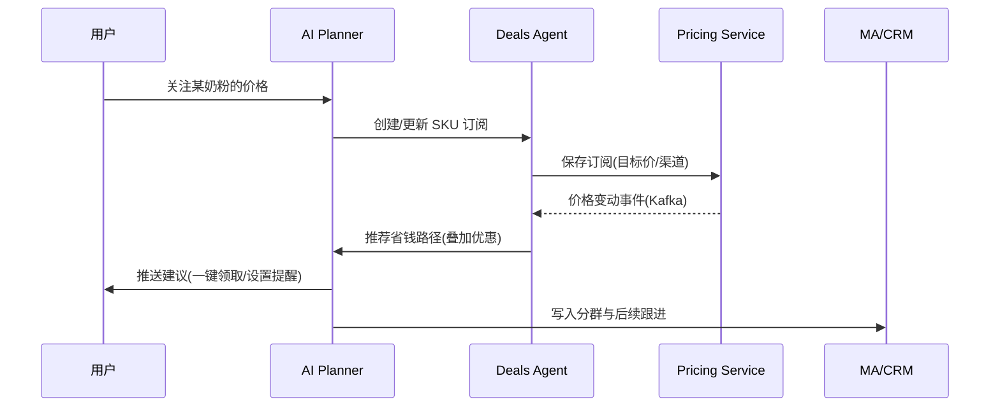

# Supermom 下一代平台技术愿景与落地方案（CTO Candidate Assignment）

## 执行摘要（Executive Summary）
- 愿景：将 Supermom 从现有 B2B2C 营销平台，升级为“Agentic AI + 社区驱动 + 代币经济”的下一代生态，既服务妈妈（B2C），又赋能品牌（B2B）。
- 方法：以 AI 聊天为核心入口，统一现有能力（线索生成、MA/CRM、调研、UGC/KOM、数据仓库）为一体化、可编排的服务；用代币化激励打造活跃社区；对外提供品牌控制台与可验证的 ROI。
- 原则：隐私优先（Consent-by-Design）、可审计（PDPA/GDPR）、分层解耦、事件驱动、可演进的模型与基础设施（Model/Vendor Neutral）。
- 路线：分四期（Foundation → B2C MVP → Agentic & Token Beta → B2B Scale & Compliance），12–15 个月达成规模化闭环。

---

## 1) AI 驱动 B2C APP/Web（以 AI 聊天为核心）
- 目标人群：备孕/孕期/婴幼儿家庭，覆盖 EN/ID/TH/VI/MY/PH 多语言。
- 入口形态：
  - 移动端 App（React Native）与 Web（Next.js）。
  - 第三方通道：WhatsApp Business、LINE（可选）作为轻触达渠道。
- 核心能力（与现有资产映射）：
  - 语义搜索 + 可信 RAG：优先医院/政府/协会来源（映射数据仓库与资讯源）。
  - 价格提醒与省钱路径：SKU 订阅、历史价趋势、优惠叠加（映射线索/活动/联盟返利）。
  - 福利/活动/展会：本地化福利与报名，逛展助手（映射活动管理与消息触达）。
  - 时间轴与提醒：疫苗/产检/补贴/补货统一提醒（与 MA/CRM、日历集成）。
  - AI 助手（MomGenie 进化版）：对话即行动（设置提醒/报名/价格订阅/UGC 提交）。
- 与医院/诊所/商户/品牌联动：
  - 机构名录与可信标签（TrustLabel）；
  - 医疗话题的就医提示与分诊建议（非诊疗）；
  - 商户/品牌活动/样品/返利路径的一键领取与记录。
- 体验要点：
  - 多语与低带宽优化、单手操作、四态（默认/加载/空/错误）、敏感医疗提示与来源展示。

---

## 2) 高层架构与技术栈（现有与新增能力的编排）
- 架构风格：事件驱动的分层架构。前 6 个月采用“模块化单体 + 独立可部署组件”，随后逐步服务化。
- 关键层次：
  - 体验层：Mobile App（React Native/Expo）/ Web（Next.js App Router）/ WhatsApp 接入。
  - 边缘层：API Gateway（Kong/NGINX）、BFF（GraphQL/REST，Next.js Route Handlers）。
  - 业务服务层：
    - 身份与同意：OIDC（Auth0/Cognito/Keycloak）、Consent Service（细粒度用途、审计）。
    - 用户与阶段画像：Profile、Stage（备孕/孕期/月龄）、偏好与设备。
    - 内容与 RAG：内容抓取与清洗、向量索引（pgvector/Weaviate/Pinecone）、Rerank。
    - 价格与优惠：SKU、渠道价、历史价、优惠叠加、订阅与通知。
    - 福利与活动：本地化清单、报名与票据、逛展路线规划。
    - 社区与 UGC/KOM：提交流程、审核质控、任务工单、KOM 管理。
    - 代币与激励：积分/代币台账、任务规则引擎、兑换商城。
    - 营销自动化与 CRM：Email/WhatsApp 编排、细分与触达、回传 Meta API。
    - 品牌控制台：活动配置、预算/KPI、A/B 测试、线索/归因报表、Clean Room（可选）。
  - 数据与智能层：
    - 数据湖/仓库：BigQuery/Snowflake（分区分域）；
    - 特征与画像：Feature Store（Feast/Tecton）；
    - 向量数据库：pgvector 或 Weaviate；
    - 模型服务：LLM 网关（OpenAI/Anthropic + 本地 Llama 备份）、Rerank（Cohere/E5）、小模型工具；
    - 代理编排：Agent Orchestrator（LangGraph/Semantic Kernel）、工具集（Tools）与安全护栏（Guardrails）。
  - 基础设施与运维：Kubernetes（EKS/GKE）、消息总线（Kafka/PubSub）、Cache（Redis）、OLTP（Postgres）、对象存储（S3/GCS）、日志/追踪（OpenTelemetry + Grafana Tempo/Loki + Prometheus）。
- 高层架构图：
```mermaid
flowchart TB
  subgraph Clients[体验层]
    A[Mobile App (RN)]
    B[Web (Next.js)]
    C[WhatsApp/LINE]
  end
  A & B & C --> G[API Gateway/BFF]

  subgraph Services[业务服务层]
    S1[Auth & Consent]
    S2[Profile & Stage]
    S3[Content & RAG]
    S4[Pricing & Deals]
    S5[Benefits & Events]
    S6[UGC & KOM]
    S7[Token & Rewards]
    S8[MA & CRM]
    S9[Brand Console]
    S10[Agent Orchestrator]
  end

  G --> S1 & S2 & S3 & S4 & S5 & S6 & S7 & S8 & S9 & S10

  subgraph Data[数据与智能层]
    D1[(Postgres/Redis)]
    D2[(Warehouse: BQ/Snowflake)]
    D3[(Vector DB: pgvector/Weaviate)]
    D4[(Feature Store)]
    D5[LLM Gateway]
    D6[Message Bus: Kafka]
  end

  S3 --> D3
  S4 --> D1
  S5 --> D1
  S6 --> D1
  S7 --> D1
  S8 --> D2
  S9 --> D2
  S10 --> D3 & D4 & D5 & D6

  G <-.-> O[Observability & SecOps]
```
- 技术栈建议：
  - 前端：React Native（Expo EAS）、Next.js（App Router）、TypeScript、Tailwind/NativeWind、i18n-next。
  - 后端：TypeScript（NestJS）为主、Python（FastAPI）用于数据处理/ML 服务。
  - LLM：OpenAI/Anthropic 作为主通道 + 本地 Llama 作为降级；RAG 使用 LangChain/LangGraph。
  - 数据：Postgres（OLTP, pgvector）、Redis、BigQuery/Snowflake、Kafka、dbt（ELT）。
  - 运维：K8s、ArgoCD、Argo Workflows、OpenTelemetry、Grafana。

---

## 3) Agentic AI 设计（自治交互与反馈闭环）
- 角色与目标：
  - 妈妈用户：获得可信答案、提醒、福利、价格省钱路径与个性化建议。
  - KOM：高质量 UGC 的创作、审核、任务协同与奖励获取。
  - 运营与品牌：自动化推荐、活动优化与透明 ROI。
- 代理体系（多代理协作）：
  - 规划代理（Planner）：解析用户意图/上下文，拆解任务并调用子代理/工具。
  - 知识代理（RAG）：从权威库检索、重排与答案结构化；医疗话题触发就医提示。
  - 省钱代理（Deals）：追踪 SKU、计算叠加优惠与预计到手价、生成订阅。
  - 活动与挑战代理（Quests）：创建/推荐社区挑战、生成任务清单与奖励规则。
  - KOM 运营代理：KOM 匹配、分配任务、监测完成度与质量评分。
  - 营销自动化代理：根据行为/阶段触发触达与再激活（Email/WhatsApp/Push）。
- 工具（Tools）示例：
  - profile_get/update、consent_check、vector_search、rerank、calendar_write、push_notify、whatsapp_send、lead_submit、deal_subscribe、event_register、ugc_submit、token_mint/burn/transfer、kom_assign、ab_test_start、meta_lead_sync。
- 反馈与学习闭环：
  - 显式反馈（有用/无用、举报、质量分）；隐式反馈（点击、停留、转化、兑换）。
  - 在线学习：策略/排序使用 Contextual Bandit；
  - 离线评估：对话安全、事实性、任务完成率、业务 KPI 等自动回归测试。
- 核心交互时序（示例：价格提醒触发 → 对话建议 → 一键领取）：


---

## 4) 社区与代币经济（激励、质控与反作弊）
- 代币形态与路线：
  - 第一年采用“积分（off-chain）”作为账本，满足合规、低成本与可回滚；
  - 预留与链上资产对接的桥接器，合规后逐步开放 on-chain。（可先选可审计的中心化账本）
- 参与与激励（示例）：
  - 妈妈：完成调研、UGC 创作、活动推广、线索转化、KOM 推荐 → 获得积分；
  - KOM：高质量内容、按期完成任务、带动转化 → 获得积分 + 现金/礼品；
  - 质控：审核通过、质量评分高、低申诉率 → 奖励倍数；
  - 惩戒：虚假/抄袭/刷量 → 扣分、冻结、黑名单。
- 经济与质控机制：
  - 发放规则：通胀率上限、任务预算池、任务难度系数、质量评分系数；
  - 质量评分：模型+人工双轨（重复检测、图像/文本鉴伪、语义相似度、历史信用）；
  - 反作弊：设备指纹、行为异常检测、关联账号识别、地理与时序校验。
- 兑换与权益：
  - 兑换商城（品牌券、样品、会员权益、现金券）；
  - 高等级解锁：KOM 候选、提前报名、内测资格。

---

## 5) B2B 集成（品牌透明度与 ROI）
- 品牌控制台：
  - 活动配置：目标人群、预算/上限、奖励、投放地域与语言、合规审批；
  - 线索与归因：跨渠道归因（UTM、深链、指纹）、转化漏斗、去标识化明细；
  - A/B 与创意优化：多方案自动分流、转化实时看板、胜出策略自动提权；
  - KOM 协同：选人、派单、进度与质检、交付与结算；
  - 数据导出与 API：Meta Lead 回传、Data Clean Room（可选）对接。
- 透明与信任：
  - 可验证报表：事件级可追踪（但合规模糊化）、合规审计轨迹、异常告警；
  - 品牌安全：黑名单屏蔽、UGC 质控、版权与肖像权合规。

---

## 6) 数据、隐私与安全（PII、同意与合规）
- 合规框架：PDPA/GDPR/本地法规 → Data Mapping、合法性基础（同意/合同/合法利益）、用途限定、最小化、留存计划、DPIA。
- 同意与权利：
  - Onboarding 粒度用途开关，可随时撤回；
  - 数据主体请求（DSR）：查询/导出/更正/删除/限制处理/反对；
  - 儿童/敏感健康数据：默认更严格的处理与加密。
- 安全控制：
  - 传输/静态加密（TLS1.3、KMS）；密钥与机密托管（Vault/KMS）；
  - 访问控制（RBAC/ABAC）、最小权限、服务间 mTLS、VPC 隔离；
  - 审计与检测：SIEM/IDS、行为审计、异常检测、备份与演练；
  - 供应商与第三方：DPA、SCC、渗透测试与安全评估。
- AI 安全与合规：
  - 提示工程与内容安全（医疗免责声明、敏感话题拦截/引导就医、模型输出审计）；
  - RAG 来源白名单与引用必显；
  - 模型/数据隔离与访问日志。

---

## 7) 可扩展与前瞻（多区域、多语言、模型可演进）
- 多区域：数据驻留与分片、区域性服务编排（价格/福利/语言/法规差异）；
- 多语言：UI 与内容分离的 i18n，RAG 按语言/区域分索引，机器翻译缓存；
- 模型中立：通过 LLM 网关与提示模板层解耦供应商，保留开源模型降级路径；
- 成本优化：请求复用与缓存、检索先行、函数调用/工具优先于长文本生成、向量与特征共用；
- 可靠性：幂等、补偿、死信队列、金丝雀与熔断、SLO/SLA 制定与自动化回滚。

---

## 8) 执行路线图（里程碑、资源与风险）
- 指标体系（核心 North Star）
  - 妈妈侧：月活/留存、任务完成率、价格提醒订阅/触达/转化、UGC 通过率、满意度。
  - 品牌侧：合格线索、CPL/CPA、ROI、A/B 胜出率、KOM 准时交付率。

- 阶段划分与里程碑（示例 12–15 个月）
  - Phase 0｜Foundation（0–6 周）
    - 架构基座：Auth/Consent、Profile、BFF、Observability、CI/CD、数据湖雏形；
    - RAG POC：医疗/母婴权威来源抓取与向量索引；
    - 价格与福利的数据模型与样例数据；
    - 风险：抓取合规与版权 → 仅白名单来源+标准引用。
  - Phase 1｜B2C MVP（第2–4 月）
    - 上线：Onboarding&同意、阶段设置、首页、搜索&RAG、价格提醒 MVP、福利/活动 MVP、AI 助手 MVP；
    - 渠道触达：Push/Email/WhatsApp 初步接入；
    - 指标：D1/7/30 留存、搜索满意度、首批价格提醒订阅≥5万。
  - Phase 2｜Agentic & Token Beta（第5–8 月）
    - 代理编排：Planner/Deals/Quests/KOM 代理协作，事件驱动触发；
    - 社区与积分：任务/挑战、UGC 审核、兑换商城（off-chain 积分账本）；
    - 品牌控制台 Beta：活动配置、A/B、报表与导出；
    - 指标：任务完成率、UGC 通过率、兑换率、品牌满意度 NPS。
  - Phase 3｜B2B Scale & Compliance（第9–12 月）
    - ROI 透明：Clean Room（可选）、更细归因与 MMM 辅助；
    - KOM 规模化：任务路由与质量分、自动结算；
    - 合规：DPIA 完成、DSR 自动化、渗透测试与应急演练；
    - 指标：CPL/CPA 优化、品牌续约率、地区扩张（≥2 市场）。

- 团队与资源（按两支产品线编组）
  - B2C Squad：PM×1、设计×1、前端×2（RN+Web）、后端×2、数据×1、QA×1。
  - Intelligence & Platform Squad：PM×1、后端×2、ML×2、数据×1、SecOps×1、QA×1。
  - 关键角色：合规负责人（兼职/顾问）、医学顾问（内容审核）。

- 关键风险与应对
  - 合规与隐私：用途限定、审计与 DSR 自动化；
  - 模型事实性与安全：RAG 白名单、医疗提示、对话评测与人审兜底；
  - 供给侧数据质量：价格/福利/UGC 数据监控、异常检测与回填；
  - 成本：LLM 请求与短信/WhatsApp 成本监控与限流、缓存与复用策略；
  - 跨区域复杂度：功能分域与可配置化、分阶段扩张。

---

## 附：与现有资产的对齐与复用清单
- 线索生成与活动管理 → 品牌控制台、任务/挑战、KOM 派单、ROI 归因。
- MA/CRM → 代理触发的分群与编排、再激活与转化闭环。
- 调研与 UTM → 社区任务与积分、问卷驱动的洞察与用户画像增强。
- 联盟（Affiliate） → 价格/福利/推广任务的自然延伸，代币化激励。
- UGC/KOM → 质量与进度可视化、与品牌活动深度联动。
- 数据仓库 → RAG、个性化与品牌报表的统一底座。

## 附：样例 API/Tool 清单（节选）
- auth.login, consent.update, profile.get/update, stage.set
- search.rag(query, lang), answer.rate
- deals.subscribe(sku, target_price), deals.summarize(sku)
- events.list(city, stage), events.register(event_id)
- reminders.create(type, time, channel)
- ugc.submit(task_id, content), ugc.review(result)
- token.mint(user_id, amount, reason), token.redeem(reward_id)
- brand.campaign.create, brand.campaign.report
- meta.lead.sync, crm.segment.add/remove

## 附：关键界面的产品映射（对齐现有 UX 文档）
- Onboarding/同意、阶段设置、首页 Feed、搜索&RAG、答案详情、价格提醒、福利与活动、逛展助理、时间轴、AI 助手。
- 统一组件：Header/StageChip/TrustLabel/PriceTag/DealPath/BenefitCard/EventCard/TimelineItem/AnswerCard/EmptyState/ConsentBlock/Toast/BottomSheet/Loading。