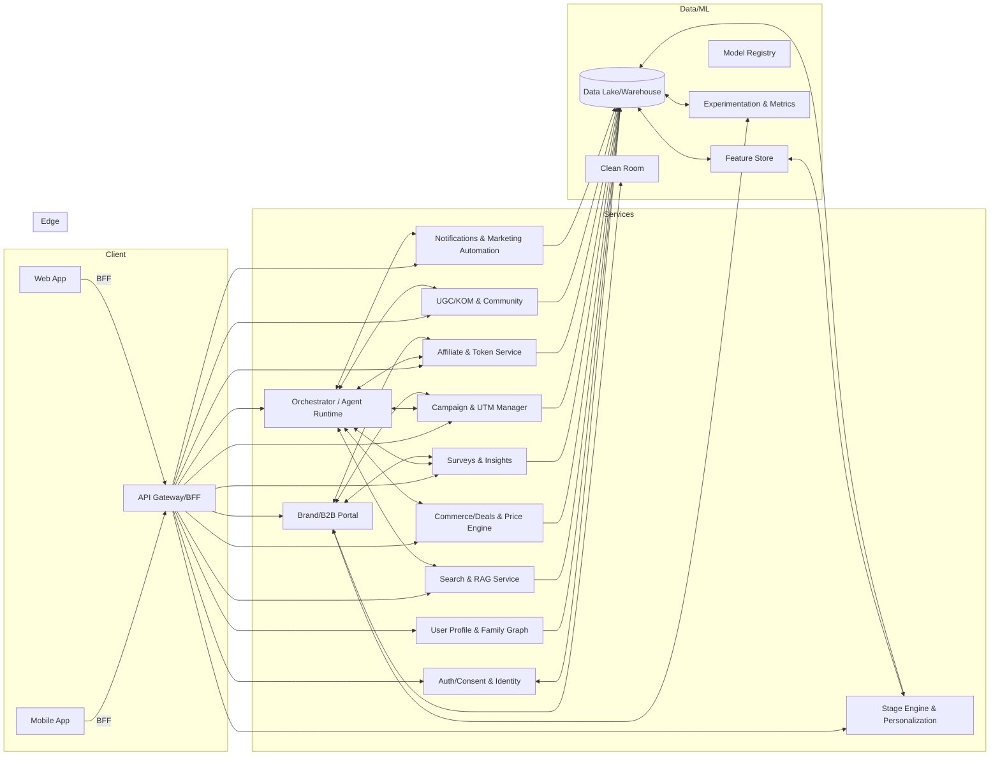

# SuperMom — Agentic, AI‑First, Community Platform (CTO Proposal)

Author: Candidate CTO  
Scope: 5–10 pages, with diagrams

## 0) Executive Summary
SuperMom will evolve from a B2BC growth platform into an AI‑first, community‑driven ecosystem that reliably serves 1,000,000 moms across SEA. We will:
- Put a stage‑aware AI assistant at the core of the consumer App/Web, integrated with hospitals, clinics, merchants and partners.
- Orchestrate agentic AI that autonomously engages moms, recommends/launches campaigns and community challenges, and activates KOMs.
- Add a token economy to reward quality participation (surveys, UGC, affiliate) and power a thriving community layer.
- Unify existing assets (lead gen, MA/CRM, insights, affiliate, UGC, DWH/personalization) under a scalable, compliant, multilingual architecture.
- Deliver measurable value via our North Star (MVI): Save Time, Save Money, Safer, Cared‑for.

---

## 1) AI‑Driven B2C Consumer App/Web (AI assistant as the core)
Principles: above‑the‑fold value, 2‑step actions, multilingual, low‑bandwidth friendly.

Core surfaces (mobile‑first, mirrored on Web):
- Home (stage‑aware): Stage card → Key Takeaways (RAG with source badges) → Mom Shares → Price Alerts (with Estimated net) → Benefits/Events → Timeline peek → Safety cue.
- Search & Answer: semantic search → AnswerCard in ≤ 20s; “Insert to list / Add reminder / Set price alert”.
- Deals: 2‑step price alerts; DealPath one‑tap “Estimated net” (coupon/cashback/threshold stacking); Savings Ledger.
- Benefits & Events (+ Expo Assistant): city/time/stage targeting; O2O route, crowd‑avoid, QR take‑home list; post‑expo unredeemed nudges.
- Timeline: vaccines/checkups/subsidies/refills; complete/reschedule/calendar sync in bottom sheet; Weekly Brief touchpoint.
- Assistant (chat): intents (hospital bag, this week’s key points, expo route); multilingual input + instant translation; medical guardrails.
- Community: Mom Shares (stage/city retrieval, instant translation), KOM profiles, groups, DM with safety/translation.

Partner bundling:
- Hospital/clinic: non‑diagnosis guidance, checkup timelines, appointment links.
- Merchants/retail/media: price feeds, coupons/cashback, affiliate tracking.
- Surveys & UTM: single‑tap joins from assistant, with incentives/tokens.

---

## 2) High‑Level Architecture

Suggested tech stack:
- Client: React Native/Flutter (mobile), Next.js (web), GraphQL or REST BFF.
- Services: TypeScript/Node.js + NestJS, or Go for high‑throughput services; Python for ML services.
- Data: BigQuery/Snowflake (DWH), object storage (GCS/S3), Kafka/PubSub, dbt; Feast for feature store.
- ML: Vertex AI/SageMaker + LangChain/LlamaIndex for RAG; Weaviate/FAISS for vector; MLflow for registry.
- Infra: Kubernetes, Helm, Terraform; API Gateway/Apigee/Kong; Cloud KMS; Cloud Armor/WAF.
- Observability: OpenTelemetry, Grafana/Prometheus, ELK, Feature flags (LaunchDarkly/Unleash).

---

## 3) Agentic AI Design
Agents and tools (autonomous but guard‑railed):
- Mom Agent (Care): stage inference, Key Takeaways (RAG), timeline extraction, Weekly Brief, benefit targeting.
- Commerce Agent (Deals): SKU/SPU normalization, price aggregation, DealPath solver, alerts.
- Community Agent: Mom Shares retrieval, translation, safety moderation, warm‑link matching; challenge orchestration.
- KOM Agent: creator matching, brief generation, content quality scoring, posting schedule optimization.
- Campaign Agent (Brand): lead routing, UTM orchestration, survey sampling, incentive allocation; ROI monitoring.

Orchestration & loop:
- Per‑user memory/state in profile graph; tool‑use via Orchestrator with policies/quotas.
- Observe → Think → Plan → Act loop; events stream back to Feature Store; A/B + uplift gating before full automation.
- Guardrails: medical red‑lines, brand policy constraints, consent scopes; HITL review lane for risky actions.

---

## 4) Community & Token Economy
Design goals: drive quality UGC, survey participation, affiliate promotion; incentivize sustained, safe engagement.
- Token accrual: surveys completion, helpful UGC (quality‑scored), campaign shares, expo scanning, verified redemptions.
- Token sinks: exclusive deals, early access, larger samples, real‑world rewards; optional donation.
- Quality control: UGC quality models (read time, saves, feedback), moderation (toxicity/misinformation/medical risk), KOM tiering.
- Challenges: stage/city‑based missions (e.g., “Weaning week”), KOM‑led prompts; team goals.
- Ledger: start off‑chain (auditable tables); optional on‑chain later for transparency.

---

## 5) B2B Integration (Brand value & transparency)
Brand Portal features:
- Self‑serve campaigns (lead gen/surveys/UGC briefs), incentive budgets, KOM recruitment.
- Real‑time dashboards: audience reach, qualified leads, survey completes, UGC engagement, affiliate conversions.
- Incrementality: clean‑room + uplift experiments (geo or holdout) for sales/brand lift; exportable reports.
- Creative support: AI brief helpers, KOM content variants, best‑time posting, content safety checks.
- Data contracts & SLAs; privacy‑preserving data exchange.

---

## 6) Data, Privacy, and Security
- Consent & PII: zero‑party consent center (scoped purposes, withdraw/export, retention); data minimization; DSR automation.
- Protection: encryption in transit/at rest; field‑level encryption for sensitive; RBAC/ABAC; least‑privilege; secrets in KMS.
- Compliance: PDPA/GDPR‑ready DPIAs; audit logs; regional residency where required; vendor DPAs; cookie/SDK governance.
- Safety: medical non‑diagnosis positioning; source badges; HITL review; red‑line filters; community standards.

---

## 7) Scalability & Future‑Proofing
- Multi‑region, multi‑tenant, i18n/L10n; stateless services behind gateway; autoscale on k8s; CDN for assets.
- Event‑driven architecture (Kafka/PubSub); idempotent consumers; outbox pattern; retries with DLQs.
- Feature flags, canary releases, blue‑green; chaos tests; SLOs with error budgets.
- AI evolution: swap LLM providers; bring‑your‑own key; hybrid retrieval; model distillation for edge.

---

## 8) Execution Roadmap (Phased)
0–90 days (Value MVP)
- Ship: stage‑aware Home; RAG V1 (EN/ID) with source badges; Deals V1 (2‑step alerts + DealPath est. net); Weekly Brief + Savings Ledger V1; Timeline V1; Mom Shares V1; agent runtime MVP; brand dashboard skeleton; analytics & eval sets.
- Targets: P50 answer ≤ 20s; alert setup ≥ 15%; verified savings ≥ 1.5%; trusted‑hit ≥ 80%.

3–6 months (Scale & breadth)
- Ship: TH/VI languages; refill prediction; benefits targeting; Expo Assistant Lite; warm‑link matches; HITL ops + moderation; anti‑fraud; brand clean‑room PoC; KOM brief/quality scoring.
- Targets: verified savings ≥ 3%; event attendance ≥ 35%; task completion ≥ 55%; trusted‑hit ≥ 85%.

6–12 months (Proof of incrementality)
- Ship: clean‑room + uplift measurement GA; psychological wellbeing light‑screen + local resources; dark mode; low‑bandwidth mode; KOC workflow (selection→creative A/B); token ledger + challenges v1.
- Targets: verified savings ≥ 5%; benefits reach ≥ 60%; task completion ≥ 70%; MVI ↑ QoQ.

12–24 months (Platformize)
- Ship: unified AI assistant (lists/routes/alerts end‑to‑end); LTV/budget optimization; multi‑market scale; partner ecosystem (retail media, health orgs);
- Targets: 1M MAU with high retention; brand renewals; token redemption satisfaction.

Resourcing (indicative)
- Squads: Search & Trust; Deals & Commerce; Care & Community; Data & AI Platform; Trust & Safety; Brand Portal.
- Headcount phase‑in: 20–30 eng/ML/design in 6 months; 40–60 by 12 months (mix of FTE and partners).

Risks & mitigations
- Medical risk → guardrails + HITL + disclaimers + partner content.
- Cross‑lingual drift → distillation + human QA + community correction.
- Attribution gaps → uplift experiments + clean‑rooms.
- Growth quality → anti‑fraud, quotas/weights, sampling transparency.

---

## Appendices
### A) Event & KPI map (aligned to MVI)
- Save Time: ask_ai, first_answer_time, decision_steps
- Save Money: price_alert_set/trigger/redeem, dealpath_expand, savings_verified
- Safer: rag_trust_hit, misinfo_report, medical_risk_prompt_click
- Cared‑for: timeline_task_add/complete/reschedule/calendar_sync, benefit_view/apply, event_register/attend
- Community: momshare_view/open/follow/dm/report/see_all, group_join/post/engage, dm_translate_toggle
- Brand: campaign_create, survey_complete, kom_onboard, affiliate_click/convert, uplift_ready

### B) Data Model (high level)
- User, Consent, FamilyGraph, Stage; Content/Source; SKU/SPU, PriceHistory, DealRule; Survey, Campaign, UTM; TokenLedger; UGC, KOM, Group; Events/Experiments.

### C) Architecture notes
- Prefer GraphQL BFF for typed aggregation; gRPC between services where latency matters; cache hot RAG chunks; use dbt for transformations; Feast for features; MLflow for model lifecycle.