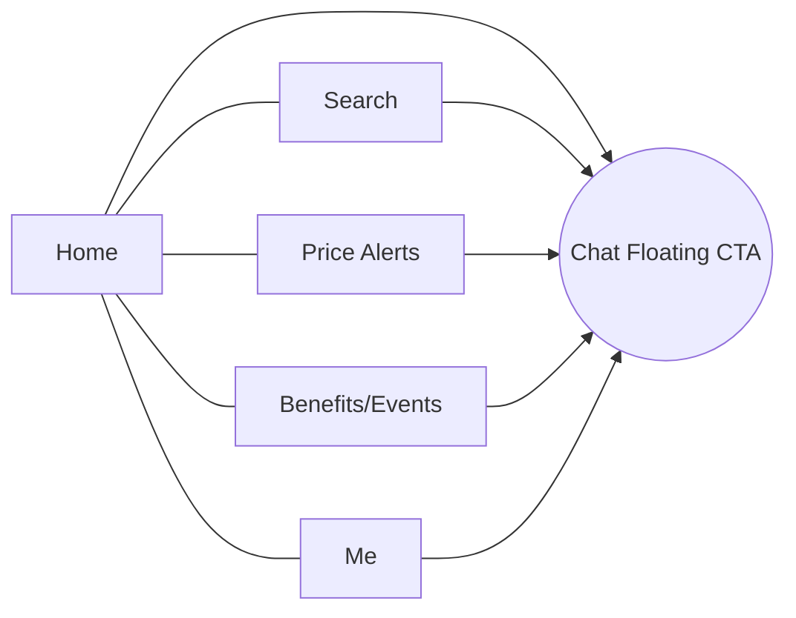
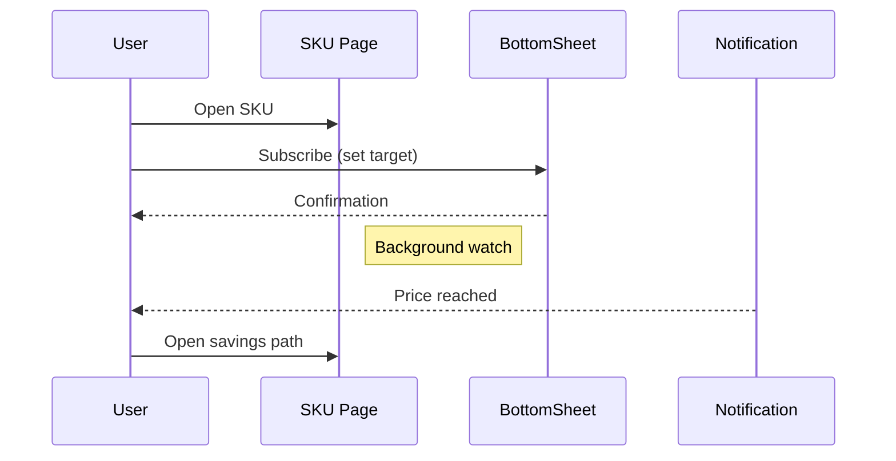
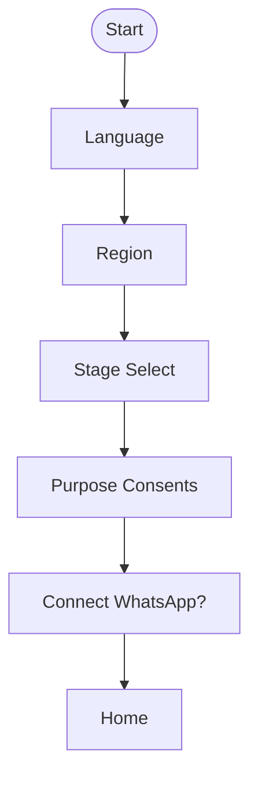

# Supermom Consumer App UX Spec (C‑end)

Aligned with: proposal_cto_supermom.md
Scope: Mobile App (React Native) and Web (Next.js). Channels: Push, Email, WhatsApp Business.

---

## 1) Personas & Principles
- Mom (pre‑pregnancy → pregnancy → newborn → infant). Goals: trusted answers, reminders, benefits/savings, community.
- Constraints: low bandwidth, single‑hand use, quick tasks (<30s), sensitive medical topics.
- Principles: clarity, empathy, safety; show sources; conversation‑to‑action; 4 states (default/loading/empty/error).

---

## 2) Information Architecture (IA)
Primary navigation (Tab bar, 5 items max):
- Home (Feed)
- Search (RAG)
- Price (Alerts)
- Benefits (Events)
- Me (Profile)

Secondary entry: Floating CTA for “Ask MomGenie” (chat) visible on all tabs; contextual shortcuts surface in feed and detail pages.

---

## 3) Key Journeys
### 3.1 Onboarding & Consent (new user)
- Entry → Language → Region → Stage select (pre‑pregnancy/pregnancy/month‑age) → Purpose‑based consent toggles (RAG personalization, notifications, analytics) → Optional: connect WhatsApp → Home.
- Success criteria: completion < 90s; explicit consent stored; skippable but re‑prompt later.

### 3.2 Trusted Search & Answer
- User types or speaks query → Suggestions (popular + stage‑aware) → Answer page with citations, TrustLabel, medical disclaimer → Actions (save, share, ask follow‑up, set reminder).

### 3.3 Price Alert & Savings Path
- Search SKU or scan barcode → SKU page: price history, retailers, stackable deals path → Subscribe (target price) → Notification → One‑tap claim/redeem.

### 3.4 Benefits & Events
- Localized list → Filters (city, stage, category) → Detail (eligibility, deadline, steps) → Register/Claim → Ticket/receipt vault.

### 3.5 Timeline & Reminders
- Auto‑generated timeline (vaccines, checkups, subsidies, replenishment) → Add to calendar → AI suggests next actions.

### 3.6 UGC & Community Challenges
- Join challenge → Task checklist → Submit UGC → QA status → Rewards (points) → Share badge.

---

## 4) Screen Blueprints (mobile first)
Wireframe elements listed top→bottom; each screen supports default/loading/empty/error.

### 4.1 Home (Feed)
- Header: StageChip, city, bell (notifications)
- Search bar (tap → Search)
- Hero cards: “Ask MomGenie”, “Track a price”, “Nearby benefits”
- Sections:
  - AnswerCard carousel (stage‑aware RAG snippets)
  - Price watch list (subscribed SKUs)
  - Benefits near you (BenefitCard)
  - Events/Expo banner
- Footer tab bar

### 4.2 Search
- Header: back, search field, mic
- Suggested searches (chips) by stage
- Results list: AnswerCard (with TrustLabel, citations count)
- Empty state: suggestion chips + “Ask MomGenie” CTA

### 4.3 Answer Detail
- Title, disclaimer, TrustLabel
- Rich content with footnote citations
- Action row: Save, Share, Follow‑up, Set reminder
- Related: FAQs, Benefits, SKUs

### 4.4 Price Alerts
- Header: Filters, add (+)
- Subscribed list: SKU row with current price, target, delta, retailers, status
- Empty: educate about alerts with example
- Detail: price history chart, savings path breakdown, subscribe/edit target

### 4.5 Benefits/Events
- Tabs: Benefits | Events
- Filters: city, stage, category
- Cards: BenefitCard/EventCard with deadline, steps
- Detail: eligibility, how‑to, map/open time, register/claim CTA

### 4.6 Chat (MomGenie)
- Thread with source badges inline
- Suggested intents (quick replies): price alert, register event, set reminder
- Tool invocations present confirmation sheets (BottomSheet)
- Error: safe fallback copy + human handoff option

### 4.7 Timeline
- TimelineItem grouped by month/week
- Item: type (vaccine/checkup/subsidy/replenish), due date, action
- Empty: set stage to generate timeline

### 4.8 Me (Profile)
- Stage & child profile
- Consents (purpose toggles) and exports (DSR)
- Connections: WhatsApp, email
- Rewards: points balance, redemption history
- Settings: language, region, notifications

---

## 5) Component Library
- Header: title, actions; sticky on scroll.
- StageChip: stage with color tags; tap to change.
- TrustLabel: source badges (Hospital/Gov/Assoc); tap to see source list.
- AnswerCard: title, snippet, badges (stage, sources), actions.
- PriceTag: price, currency, delta vs history, retailer.
- DealPath: steps for stackable savings (coupon, card, code) with totals.
- BenefitCard/EventCard: title, city, deadline, eligibility, CTA.
- TimelineItem: icon, due date, action.
- ConsentBlock: purpose, toggle, learn‑more link.
- Toast/Snackbar: brief confirmations.
- BottomSheet: confirmations/forms (e.g., subscribe target price).
- Loading: skeletons for lists/cards; shimmer.
- EmptyState: icon, primary copy, 1 actionable CTA.

---

## 6) States & Patterns
- Default: content with primary actions visible above the fold.
- Loading: skeletons (no spinners in lists > 600ms).
- Empty: educational copy + CTA to create/enable feature.
- Error: short plain copy, retry button, support link (no codes exposed).
- Sensitive/Medical: always show disclaimer and sources; suggest seeking professional care where applicable.

---

## 7) Copy & Tone (EN examples)
- Voice: warm, supportive, clear; avoid fear; no medical diagnosis.
- Examples:
  - Empty Search: “No exact match. Try a simpler term or ask MomGenie.”
  - Medical Disclaimer: “For informational purposes. Not a substitute for professional medical advice.”
  - Price Alert Created: “We’ll watch this item and notify you when it drops to your target.”

Localization: maintain short sentences; prefer nouns over complex verbs; keep ≤ 60 chars for titles.

---

## 8) Accessibility & Internationalization
- Color contrast ≥ WCAG AA; tap targets ≥ 44dp; dynamic type supported.
- Screen reader labels for all icons; announced changes for live regions (toasts).
- RTL readiness for languages that require it.
- i18n keys; date/number/currency by locale; region‑scoped content feeds.

---

## 9) Notifications & Channels
- Push: transactional (alerts, registrations), rate‑limited; deep link to detail pages.
- WhatsApp: opt‑in only; concise (≤ 3 lines) with clear CTA link.
- Email: summaries and confirmations; weekly digest option.

---

## 10) Trust & Safety
- Report content on Answer/UGC; simple 3‑step flow.
- Source transparency: show badges and linkouts.
- Privacy center in Me: consents, export/delete request (DSR), policy links.

---

## 11) Measurement (Events & KPIs)
Event naming (snake_case):
- search_performed, answer_viewed, citation_opened, followup_clicked
- price_subscribed, price_notification_opened, price_claim_clicked
- benefit_viewed, benefit_registered, ticket_viewed
- chat_opened, chat_tool_invoked, chat_task_completed
- timeline_item_completed, reminder_set
- consent_updated, dsr_requested

Screen context: screen_name, locale, stage, city, ab_variant.

---

## 12) Example Flows (Mermaid)
### 12.1 Price Alert Flow

### 12.2 Onboarding & Consent

---

## 13) Acceptance Criteria (MVP)
- Onboarding completion ≥ 80%, time ≤ 90s; consents stored and retrievable.
- Search satisfaction (thumbs up) ≥ 60%; citation open rate ≥ 25%.
- Price alert subscription ≥ 50k within 3 months; notification open rate ≥ 35%.
- Benefit registration conversion ≥ 15% from view.
- Crash‑free sessions ≥ 99.5%; TTI ≤ 2.5s P75 on 3G fast.

---

## 14) Deliverables
- Figma wireframes following above blueprints; component variants (default/loading/empty/error).
- i18n copy spreadsheet (EN + target locales).
- Tracking plan mapped to analytics SDK (screen + events + properties).